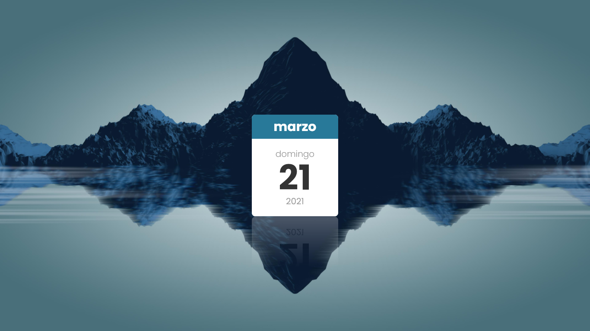

# 📆 Calendar 📆

Hello! this is a small project in which I have created a calendar with HTML, CSS and JavaScript. 😄

# 👀 Calendar link 👀

https://openvek.github.io/Calendar/

# 📷 Screenshot 📷

# 🧰 Built with 🧰

* HTML
* CSS
* JavaScript
* Visual Studio Code

# ✒️ Authors ✒️

* Kevin Alvarez (OpenVek)

# 📋 License 📋

This project is under the Apache 2.0 license - see the LICENSE.md file for more information

# 👉🏻 Contact me 👈🏻

* Twitter: https://twitter.com/OpenVek  

* Instagram: https://www.instagram.com/OpenVek/  

* Github: https://github.com/OpenVek  

* Gmail: kevinalvarezdev@gmail.com  

Made with ❤️ by Kevin Alvarez (OpenVek)

